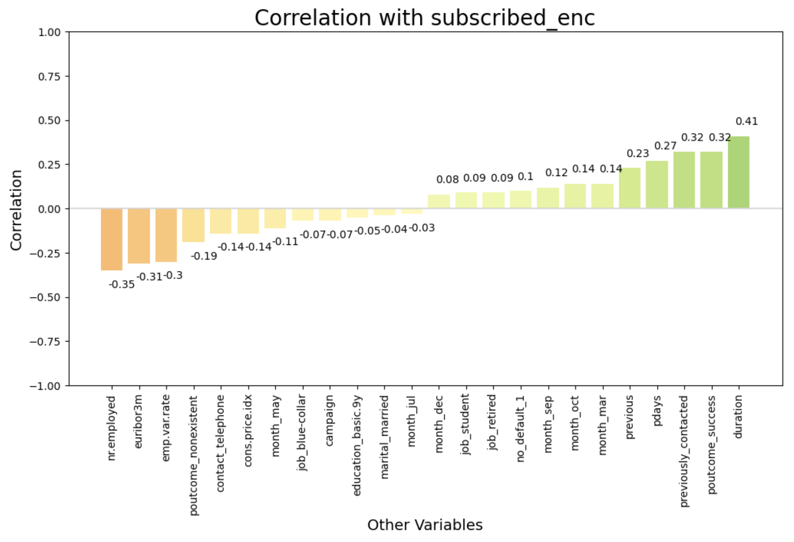
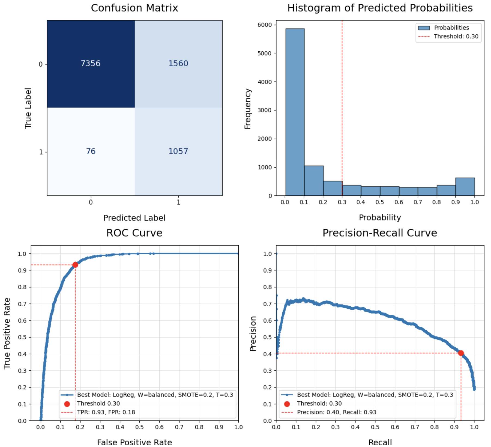
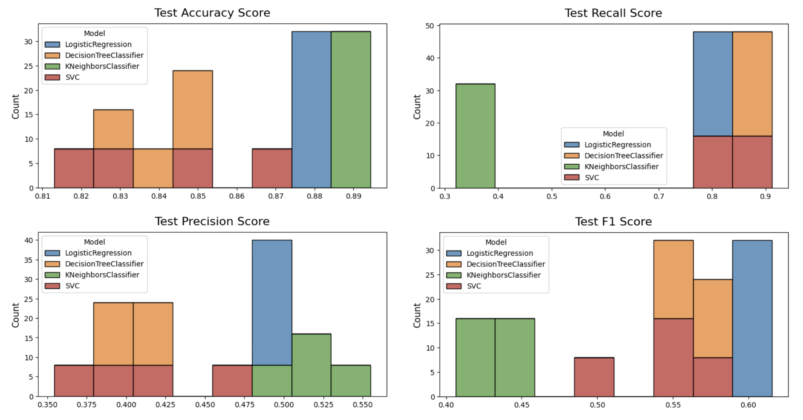
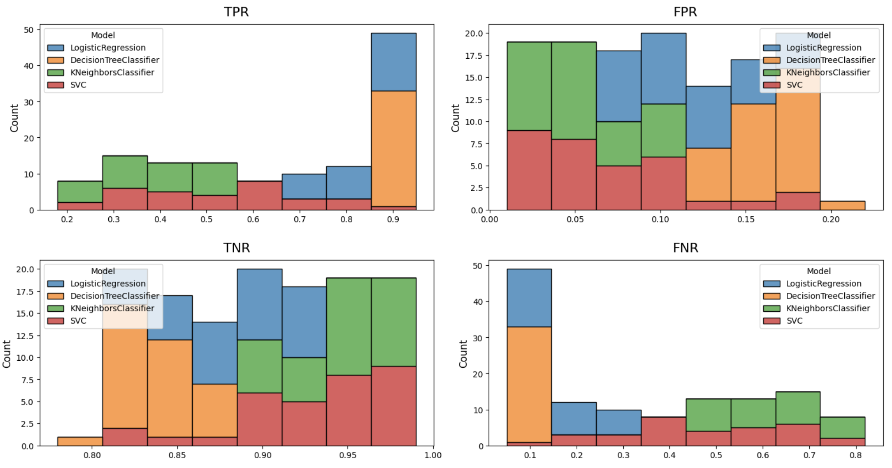
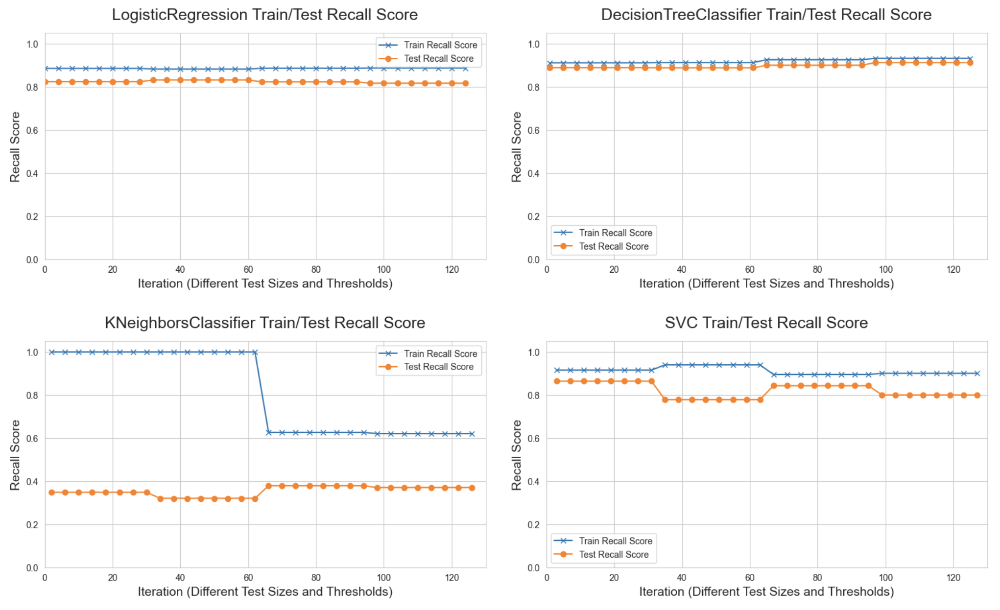

# Bank Marketing Campaign Analysis

This is an analysis of a Portuguese bank direct marketing campaign. It identifies the factors associated with a successful campaign (phone calls), resulting in clients subscribing to a bank term deposit. It also evaluated 4 different classification models (Logistic Regression, Decision Tress, KNN Classifier, SVM), and identified the best model and parameters for this use case. This was a project for the U.C. Berkeley Certificate in Machine Learning & Artificial Intelligence. The entire process follows the CRISP-DM framework and is documented in this Jupyter notebook file:

* [bank.ipynb](bank.ipynb)

## Background

European banks need to strengthen their financial assets. One approach is to offer long-term deposits with low interest rates through direct marketing campaigns. At the same time, they also need to reduce their costs and turnaround time. Unfortunately, the public has experienced some fatigue from all these campaigns, and they are not as effective as they could be. Can we learn from the data to find out what customer attributes increase the chance of a successful deposit? If so, the campaigns can be tailored to these high-probability prospects, avoiding wasted time and resources on those that are less likely to deposit.

## Business Objectives

1. **Describe Characteristics of Successful Deposits** – Identify the characteristics of the campaigns or clients that end up depositing money, vs. those that don't. This will allow the banks to target the customers that are most likely to deposit.
1. **Create Predictive Model** – Create a machine learning model that will classify prospects as either likely to deposit or not, based on their characteristics.
1. **Compare Performance of Classifiers** – Compare the performance of the following classifiers: K-Nearest Neighbors, Logistic Regression, Decision Trees, and Support Vector Machines.

## Data

The data used in this analysis is the [Bank Marketing](https://archive.ics.uci.edu/dataset/222/bank+marketing) dataset from the [UC Irvine Machine Learning Repository](https://archive.ics.uci.edu/). It was originally published in this research paper: \[Moro et al., 2014\] S. Moro, P. Cortez and P. Rita. [A Data-Driven Approach to Predict the Success of Bank Telemarketing](https://www.semanticscholar.org/paper/cab86052882d126d43f72108c6cb41b295cc8a9e). Decision Support Systems, In press, http://dx.doi.org/10.1016/j.dss.2014.03.001

# Summary of Findings

## Descriptive Statistics

### Clients

Here's what we learned about the clients that were targeted by the marketing campaign:

* For their occupation, most were **Admins** (25.3%) or **Blue Collar** (22.47%).
* The majority of the clients were **Married** (60.52%).
* For education, most had either a **University Degree** (29.54%) or **Completed High School** (23.1%)
* Most had **No Personal Loan** (82.43%), but did have a **Housing Loan** (52.38%).
* Most had **No Default** (79.12%) on their credit.

### Campaigns

We've also learned some things about how they were contacted by phone as part of this campaign:

* The majority were contacted for the **First Time** (86.34%) and did not have a prior campaign outcome.
* Most were contacted during **Summer**: May (33.43%), June (12.91%), July (17.42%), August (15%). No one was contacted in January or February.
* The days of the week were evenly distributed between 19-21% each.
* Most were contacted on their **Cellphone** (63.47%)
* The majority **Declined the offer** (88.73%)

## Business Objectives

### 1. Describe Characteristics of Successful Deposits

  

    
  

Surprisingly, **macroeconomic factors** seem to have a strong influence on successful deposits:

* **Number Employed** has a moderate negative correlation at -0.35. This suggests that as the employment rate goes down, people are more likely to deposit. Perhaps a less favorable economic environment might drive people to save money rather than spend it, and thus deposits increase.
* **Euribor 3-Month** has a moderate negative correlation at -0.31. This is the average interest rate at which banks lend to each other for 3 month terms, set for the Euro region. When the Euribor 3-Month rate is low, borrowing costs are also low. It means that banks can borrow money cheaply, and they might pass on this benefit to their customers by offering higher interest rates on deposits. This makes deposits more attractive, and could explain the correlation.
* **Employment Variation Rate** has a moderate negative correlation at -0.30. This is the rate of change in employment levels from one quarter to the next. As this decreases or goes negative, it would indicate slowing or decreasing employment levels. This portrays a less favorable economic environment, which might prompt people to save money, thus an increase in deposits.
* **Consumer Price Index** has a slight negative correlation at -0.14. This is a measure of the prices paid for goods and services by consumers over time, and indicates inflation. If this is low, it could be that people have more savings on hand, and are more likely to save it. But this correlation is on the low side.

The direct marketing **campaign statistics** also had a strong influence on successful deposits: 

* **Success of the Previous Campaign** has a moderate positive correlation at 0.32. This suggests that a client that previously subscribed has a greater chance of subscribing again in the future.
* **Previously Contacted** has moderate positive correlation at 0.32, **Days Since Last Contact for Previous Campaign** has a slight positive correlation at 0.27, and **Number of Previous Contacts** has a slight positive correlation at 0.23. So it appears the number of previous contacts increase the chance that a client will subscribe, and the longer the timeframe after the last contact, the better the chances.
* **No Previous Outcome** has a slight negative correlation at -0.19, which is basically in alignment with what we've learned about the importance of prior contacts.
* **Contact by Telephone** has a slight negative correlation at -0.14, for unknown reasons.
* **March and October** have a slight positive correlation at 0.14, and **September** has a slight positive correlation at 0.12, so perhaps there's something about that time of the year that makes clients more likely to subscribe. In contrast, **May** has a slight negative correlation at -0.11, so perhaps that has the opposite effect.

Not many **client characteristics** stood out as having an impact on successful deposits:

* **No Credit Default** has a slight positive correlation at 0.1, suggesting those that never had a credit default are slightly more likely to deposit. This could perhaps mean that those who never had a default are more likely to plan for the future and save.
* **Students** and **Retired** have a slight positive correlation at 0.09, suggesting those clients are more likely to deposit, perhaps because students are thinking about their future, and retirees are trying to preserve the money they've accumulated in a low-risk vehicle. In contrast, **Blue Collar** workers have a slight negative correlation at -0.11, suggesting they are less likely to deposit - perhaps because they have less money to deposit, or more willing to take on riskier investments. 

### 2. Create Predictive Model

We took a systematic approach to exploring 4 different kinds of models: Logistic Regression, Decision Tree Classifier, K-Nearest Neighbors (KNN) Classifier, and Support Vector Machines (SVM). A baseline was established, and then a basic Logistic Regression model was built. It became clear the data was imbalanced, so the minority class was oversampled, and (where supported) class weights were balanced in the models. A random search was then run across (a) different Train/Test split test sizes, (b) proability thresholds for determining class, and (c) 36 different hyperparameter values (only a subset are relevant to each model). All together, 128 different model configurations were explored.

#### Evaluating Metrics

Given the business problem here, we chose **Recall** and **False Negative Rate** as the main metrics to evaluate model performance, though other metrics were examined to ensure as much of a balanced performance as possible. The banks make money on every person they convince to subscribe to a deposit. Without this analysis, they would've contacted everyone, which is expensive. So the goal is to eliminate as many clients as possible from the contact list – without sacrificing those that would likely make a deposit. So the best metric is Recall, which measures the model's ability to identify the positive class (a successful campaign resulting in a subscription to a term deposit). False Negatives represent actual positives that were mis-classified as negative, so the two metrics are related. We want to minimize the false negatives, as that represents a lost financial oportunity for the bank.

#### Best Model

After performing the search, the best model for maximum Recall and the least False Negatives is the following, which **successfully classified 93%** of the clients that would make a deposit, and **only missed 76** out 1,133 of them:

* **Model**: Logistic Regression (Index 32)
* **Test Size**: 0.25
* **Minority Oversample**: 0.20
* **Threshold**: 0.30
* **Recall**: 0.83 Test, 0.88 Train (Overfit, 0.05 difference)
* **F1**: 0.62 Test, 0.73 Train
* **Accuracy**: 0.88 Test, 0.89 Train
* **Precision**: 0.39 Test, 0.62 Train
* **True Positive Rate**: 0.93 (1,057 True Positives)
* **True Negative Rate**: 0.83 (7,356 True Negatives)
* **False Negative Rate**: 0.07 (76 False Negatives)
* **False Positive Rate**: 0.17 (1,560 False Positives)
* **Best Params**: 'logreg__solver': 'lbfgs', 'logreg__C': 1

Although there are better Recall scores for Decision Trees (0.91 was the best), the number of False Negatives and False Positives are worse than what we have for this Logistic Regression model. The Decision Tree model had 139 False Negatives, almost double, and 2,224 False Positives, almost 50% more. This illustrates that the final decision here is judgement call, and not simply taking the model with the highest score.

  

    
  

### 3. Compare Performance of Classifiers

While searching for the best model, the performance of the 4 different classification models were evaluated, and this is what we found:

#### Key Metrics

* **SVC** has the longest Fit Time by a longshot, and the longest Inference Time
* On the Train data, **KNN** had the highest Accuracy, Precision, and F1 scores, and the worst Recall scores. However, it was the most overfit, as represented by the difference in training and test scores. This is likely because of the imbalanced dataset, and the lack of options (like class weights) to help it pick up on the minority class.
* **Logistic Regression** and **Decision Trees** scored the best on True Positives (highest count) and False Negatives (lowest count). Similarly for the True Positive Rate and False Negative Rate.
* **Logistic Regression** and **Decision Trees** also scored the lowest on the total error represented by the False Rate (sum of False Positive and False Negative Rates). They were consistently on the low end here, whereas KNN and SVC had a much wider spread and dominated the high end. They were much more prone to error on the test set

  

    
  

  

    
  

#### Train vs. Test and Overfitting

* **Recall** – Decision Trees stand out for their (1) consistency across all the iterations, and (2) the low difference between Train and Test scores. Although every single model was overfit to some degree, Decision Trees were overfit the least. It's a negligable difference. KNN was affected significantly with the changing Test sizes and thresholds. It may be that a certain point, there was not enough training data to do well on the train test. Regarding Test Recall performance, Decision Trees and Logistic Regression perform the best, followed by SVC, and KNN is pretty bad.

* **F1** – There's not much difference on performance between Decision Trees, Logistic Regression, and SVC – just SVC has more variability through the iterations. KNN performs significantly worse on Test F1, it's significantly overfit on the majority class.

* **Accuracy** – Accuracy is not the best metric for our use case, because it doesn't work well with imbalanced data – it's biased toward the majority class. Logistic Regression is the best in performance with very little overfit, but the Test Accuracy performance is roughly comparable for all.

* **Precision** – Given we're trying to find as much of the minority class as possible (Recall), we're sacrificing some precision, and none of the models performed well with this metric. KNN seems to be the only one with greater than 0.50 Test Precision.

  

    
  

## Limitations

There are a few limitations in the data:

* **Duration:** This analysis included the Duration variable, which has a disclaimer in the data description: "this attribute highly affects the output target (e.g., if duration=0 then y='no'). Yet, the duration is not known before a call is performed. Also, after the end of the call y is obviously known. Thus, this input should only be included for benchmark purposes and should be discarded if the intention is to have a realistic predictive model."
* **Unknown Values:** There were a large number of missing values (NaNs, or null values) that were encoded as 'Unknown' in this dataset. Most of these were retained and treated as an additional category, though a few records were dropped. 
* **999 Values:** During data cleaning, a number of '999' values were converted to '0' for 'pdays' – the number of days that passed after the client was last contacted from a previous campaign. Shifting this number removed the outlier effect, but it did also change the impact these numbers have on correlations. 

## Next Steps and Recommendations

Given the limitations and constraints of this analysis, this project could be followed up in the following ways:

* **Drop Duration:** A second round of analysis should be done with Duration dropped as a feature. This will likely lead to lower performance, and may require additional feature engineering or techniques to boost performance. But for a model that can truly be generalized to unseen data, this should be dropped.
* **Different Encodings:** Some of the data cleaning methods mentioned (ex: 999 values) could be revisited and treated differently in a follow-up analysis.
* **Different Models:** In this project, we only used 4 classification models: Logistic Regression, Decision Trees, KNN Classifier, and Support Vector Machines (SVM). Comparing this 4 models was an explicit goal. But there are other classification models that might yield better results: Rand Forest, and XGBoost, for instance.
* **Cost Factors:** The financial gain of a successful deposit should be quantified, in addition to the financial cost of a campaign. The model we ended up with maximizes finding all the successful depositors, but it does so at the expense of misclassifying a number of clients as depositors incorrectly. Ideally the financial gain from succesful deposits offsets the cost of contacting clients that ultimately don't deposit. 
* **Top Correlated Features:** A dataframe of the top correlated features was created, but we did not have time to do analysis of this dataset. This should be examined in a follow-up analysis.